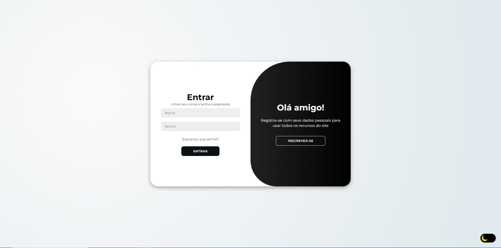

  <h2 align="center">Formulário de Login de usuário</h2>

  Uma página simples e responsiva para fazer login e cadastro de um usuário,  utilizando HTML, CSS, JavaScript, Node.js e MongoDB. . 

  <a href="#"><strong>➥ Demo Website</strong></a>

  

# View simples do website:

  

<h1 align="center">
  Testando o projeto
</h1>

## Bibliotecas necessárias

No diretório do projeto, você deve executar:

#### `npm install Express`
#### `npm install Mongoose`
#### `npm install bcrypt`
#### `npm install ejs`
#### `npm install --save-dev nodemon`

Para iniciar o arquivo execute:
#### `npm run dev`
Abra [http://localhost:3000](http://localhost:3000) para vizualizá-lo no seu navegador.

Recarregue a página para cada alteração que vc fizer.

  

<h1 align="center">
  Tecnologias e ferramentas utilizadas 💡
</h1>

 
        
        
        
        
        
        
        
    

  

<h1 align="center">
  Conecte comigo: 👇
</h1>

<section align="center">
  

    
    
    
  

</section>